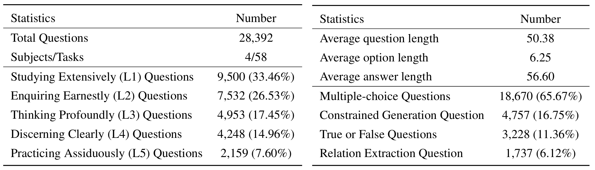

<div align="center">

<h1 align="center">   SciKnowEval: Evaluating Multi-level Scientific Knowledge of Large Language Models </h1>

<p align="center">
  <a href="https://arxiv.org/abs/2406.09098">📖 Paper</a> •
  <a href="http://www.scimind.ai/sciknoweval/">🌐 Website</a> •
  <a href="https://huggingface.co/datasets/hicai-zju/SciKnowEval">🤗 Dataset</a> •
  <a href="#2">⌚️ Overview</a> •
  <a href="#3">🏹 QuickStart</a> •
  <a href="#4">🏅 Leaderboard</a> •
  <a href="#6">📝 Cite</a>
</p>

<p align=right><b>博学之 ，审问之 ，慎思之 ，明辨之 ，笃行之。</b></p>
<p align=right>—— 《礼记 · 中庸》 <i>Doctrine of the Mean</i></p>

<div align=center></div>

<p></p>
</div>

The <b>Sci</b>entific <b>Know</b>ledge <b>Eval</b>uation (<b>SciKnowEval</b>) benchmark for Large Language Models (LLMs) is inspired by the profound principles outlined in the “<i>Doctrine of the Mean</i>” from ancient Chinese philosophy. This benchmark is designed to assess LLMs based on their proficiency in **Studying Extensively**, **Enquiring Earnestly**, **Thinking Profoundly**, **Discerning Clearly**, and **Practicing Assiduously**. Each of these dimensions offers a unique perspective on evaluating the capabilities of LLMs in handling scientific knowledge.

## 🆕 News

- **\[Jun 2024\]** We released the [SciKnowEval dataset](https://huggingface.co/datasets/hicai-zju/SciKnowEval) on Huggingface 🤗.


## 📌 Table of Contents

- [⌚️ Overview](#2)
- [🏹 QuickStart](#3)
  - [⬇️ Installation](#3.1)
  - [📜 Prepare data](#3.2)
  - [🛒 Prepare models](#3.3)
  - [🚀 Evaluate](#3.4)
- [🏅 SciKnowEval Leaderboaed](#4)
- [📝 Cite](#6)
- [✨ Acknowledgements](#7)
---

<h2 id="2">⌚️  Overview</h2>

<h3 id="2.1">✡️ Evaluated Abilities</h3>

* 📖 **L1**: **Studying extensively** (i.e., *knowledge coverage*). This dimension evaluates the breadth of an LLM's knowledge across various scientific domains. It measures the model's ability to remember and understand a wide range of scientific concepts.

* ❓ **L2**: **Enquiring earnestly** (i.e., *knowledge enquiry and exploration*). This aspect focuses on the LLM's capacity for deep enquiry and exploration within scientific contexts, such as analyzing scientific texts, identifying key concepts, and questioning relevant information.

* 💡 **L3**: **Thinking profoundly** (i.e., *knowledge reflection and reasoning*). This criterion examines the model's capacity for critical thinking, logical deduction, numerical calculation, function prediction, and the ability to engage in reflective reasoning to solve problems.

* 🔨 **L4**: **Discerning clearly** (i.e., *knowledge discernment and safety assessment*). This aspect evaluates the LLM's ability to make correct, secure, and ethical decisions based on scientific knowledge, including assessing the harmfulness and toxicity of information, and understanding the ethical implications and safety concerns related to scientific endeavors.

* 🔬 **L5**: **Practicing assiduously** (i.e., *knowledge practice and application*). The final dimension assesses the LLM's capability to apply scientific knowledge effectively in real-world scenarios, such as analyzing complex scientific problems and creating innovative solutions.

<h3 id="2.2">🎯 Domains and Tasks</h3>
<div align=center></div>

<h3 id="2.3">📊 Data Stats</h3>

<div align=center></div>

<h3 id="2.4">🛠️ Data Construction</h3>

<div align=center></div>

* 🤖 *<b>Generating New QAs from Literature Corpus:</b>*
This method involves collecting scientific papers from sources like BioRxiv, PubMed, and textbook databases such as LibreTexts. Large Language Models (LLMs) are used to automate the generation of QA pairs by designing effective prompts based on domain experts' advice. These prompts guide the LLMs to extract relevant knowledge from literature and generate QA pairs that ensure answers are explicitly found in the original text without adding external information.

* 🔩 *<b>Refactoring the Existing QAs:</b>*
Additional QAs are sampled from existing scientific benchmarks like MedMCQA, SciEval, and others. LLMs are employed to refactor these QAs by rewriting questions and reordering options to avoid data contamination and leakage. In cases where QAs lack explicit annotations for their corresponding levels in SciKnowEval, LLMs automatically categorize the data into distinct levels.

* ⚗️ *<b>Transforming Scientific Databases:</b>*
This approach transforms data from biological and chemical databases (e.g., PubChem, UniProtKB) into textual formats suitable for LLM evaluation. It starts with quality screening, such as filtering invalid chemical structures, followed by the use of multiple question templates to convert structured data (like sequence annotations) into natural language QA pairs, including multiple-choice and true/false formats.

* ✅ *<b>Quality Control</b>*: To further ensure the accuracy and reliability of the dataset, each task within our dataset undergoes validation by two domain experts in biology and chemistry. Experts evaluate the relevance and correctness of the scientific problems and solutions.

<h2 id="3">🏹 QuickStart</h2>
<h3 id="3.1">⬇️ Step 1: Installation</h3>

To evaluate LLMs on SciKnowEval, first clone the repository:
```bash
git clone https://github.com/HICAI-ZJU/SciKnowEval.git
cd SciKnowEval
```
Then, install the required dependencies:
```bash
pip install -r requirements.txt
```


<h3 id="3.2">📜 Step 2 : Prepare data</h3>

* **Download** the SciKnowEval benchmark data: You should first download our dataset. We provide two sources:
  
  1. 🤗 HuggingFace homepage: [https://huggingface.co/datasets/hicai-zju/SciKnowEval](https://huggingface.co/datasets/hicai-zju/SciKnowEval)
  
  2. The `./raw_data/` folder in this repository: We split the dataset by level (L1~L5) and task. You can download and integrate the data into a single JSON file. 

* `eval.py` is the official evaluation code of SciKnowEval. You only need to provide the model's answer results in JSON format to evaluate.

* ❗Note that each data in the JSON file must contain all the original information, such as question, choices, answerKey, type, domain, level, task and subtask, as shown below:

```python
[
  {
    "question": "The question", 
    "choices": {
      "text": ["option A", "option B", "option C", "option D"], 
      "label": ["A", "B", "C", "D"]
    }, 
    "answerKey": "A", 
    "type": "mcq-4-choices", 
    "domain": "Chemistry or Biology", 
    "details": {"level": "level", "task": "xx", "subtask": "xx"}, 
    "response": "A"  # response is the model's prediction
  },
  # ...
]
```

In summary:
* Please preserve *all fields of the original data* as much as possible.
* Please save the model's predicted answers in the "*response*" field.


<h3 id="3.3">🛒 Step 3: Prepare models</h3>

**1. For relation extraction tasks, we need to calculate the text similarity with `word2vec` model. We use *GoogleNews-vectors* pretrained model as the default model.**

- Download `GoogleNews-vectors-negative300.bin.gz` from [this link](https://github.com/mmihaltz/word2vec-GoogleNews-vectors) to local.

> The relation extraction evaluation code was initially developed by the [AI4S Cup](https://bohrium.dp.tech/competitions/3793785610?tab=datasets) team, thanks for their great work!🤗

**2. For tasks that use GPT for scoring, we use OpenAI API to assess answers.**

- Please set your OpenAI API key in the `OpenAI_API_KEY` environment variable. Use `export OPENAI_API_KEY="YOUR_API_KEY"` to set the environment variable.

- If you do not set the `OPENAI_API_KEY` environment variable, the evaluation will automatically **skip the tasks that require GPT scoring**.

- 📣 We select `gpt-4o` as the default evaluator !


<h3 id="3.4">🚀 Step 4: Evaluate</h3>

You can run `eval.py` to evaluate your model:

```bash
data_path="your/model/predictions.json"
word2vec_model_path="path/to/GoogleNews-vectors-negative300.bin"
gen_evaluator="gpt-4o" # the correct model name in OpenAI
output_path="path/to/your/output.json"

export OPENAI_API_KEY="YOUR_API_KEY"
python eval.py \
  --data_path $data_path \
  --word2vec_model_path $word2vec_model_path \
  --gen_evaluator $gen_evaluator \
  --output_path $output_path
```
 

<h2 id="4">🏅 SciKnowEval Leaderboaed</h2>

<!-- | Rank | Models          | Biology |    |    |    |    |    | Chemistry |    |    |    |    |    |
|:----:|:----:|:----:|:----:|:----:|:----:|:----:|:----:|:----:|:----:|:----:|:----:|:----:|:----:|
| |                 | L1   | L2   | L3   | L4   | L5   | Bio Average  | L1   | L2   | L3   | L4   | L5   | Chem Average  |
|1| 🥇 **claude-3.5-sonnet-20240620** | _3.00_    | _5.50_    | 8.14   | **2.67**   | **1.20**    | **4.84**    | **1.33**    | _3.57_    | **1.43**    | **2.00**     | 8.00     | 3.21     |
|2| 🥈 **gpt-4o**                     | 4.50    | **3.75**   | _7.86_   | 5.67   | _2.00_    | **4.84**    | _1.67_    | 4.57    | 5.71    | 10.33   | 4.00     | 5.17     | 
|3| 🥉 **gemini-1.5-pro-latest**      | 7.50    | 7.50    | **7.71**  | _5.00_    | 8.60    | 7.48    | 4.33    | 6.86    | _5.00_    | _3.67_    | 15.75   | 7.08     | 
|4| gpt-4-turbo-2024-04-09     | 8.00    | 8.12   | 9.71   | 6.33   | 5.60    | 7.84    | 5.00     | **2.43**    | 10.14   | 8.33    | 10.25   | 7.04     | 
|5| qwen2-72b-instruct         | **2.50**    | 5.62   | 13.43  | _5.00_    | 6.60    | 7.68    | 5.00     | 3.86    | 10.29   | 5.00     | 11.25   | 7.25     | 
|6| claude-3-sonnet-20240229   | 10.50   | 6.62   | 11.57  | 7.33   | 3.00    | 7.68    | 9.67    | 8.00     | 10.86   | 11.33   | 6.25    | 9.17     | 
|7| glm-4                      | 6.50    | 6.25   | 8.43   | 8.33   | 9.80    | 7.84    | 9.67    | 8.86    | 11.43   | 7.33    | 8.00     | 9.38     | 
|8| qwen-max                   | 3.50    | 11.25  | 10.14  | 6.67   | 11.40   | 9.80     | 5.67    | 5.43    | 9.29    | 6.00     | 14.00    | 8.08     | 
|9| yi-large                   | 8.00    | 10.88  | 13.29  | 8.33   | 16.00   | 12.04   | 7.33    | 7.00     | 11.86   | 7.33    | 13.75   | 9.62     | 
|10| gpt-3.5-turbo              | 5.50    | 11.62  | 15.86  | 8.33   | 11.60   | 11.92   | 14.00   | 12.71   | 11.57   | 11.33   | 9.00     | 11.75    | 
|11| llama3-8b-inst             | 13.5   | 9.00    | 16.00   | 11.33  | 13.60   | 12.52   | 10.67   | 10.86   | 12.00    | 11.00    | 19.00    | 12.54    | 
|12| qwen1.5-14b-chat           | 10.00   | 14.62  | 11.86  | 14.00   | 9.40    | 12.36   | 14.33   | 12.00    | 9.43    | 13.00    | 14.75   | 12.12    | 
|13| ChemDFM-13b                | 11.00  | 15.00   | 15.86  | 14.00   | 15.60   | 14.92   | 11.33   | 14.43   | 11.29   | 13.33   | _1.75_    | 10.88    | 
|14| ChemLLM-20b-chat           | 17.50   | 10.25  | 13.57  | 19.67  | 14.40   | 13.72   | 15.00    | 12.57   | 14.57   | 21.33   | 4.25    | 13.17    | 
|15| qwen1.5-7b-chat            | 14.00   | 14.25  | 18.43  | 13.00   | 11.20   | 14.64   | 15.67   | 14.86   | 12.86   | 16.67   | 17.75   | 15.08    | 
|16| molinst-biotext-8b         | 18.5   | 13.75  | 10.86  | 17.00   | 21.20   | 15.20    | 14.33   | 14.43   | 10.71   | 14.33   | 22.75   | 14.71    | 
|17| chatglm3-6b                | 17.00   | 18.62  | 15.14  | 14.33  | 15.00   | 16.28   | 20.33   | 20.00    | 19.43   | 17.33   | 17.75   | 19.17    | 
|18| galastica-30b              | 16.00   | 18.00   | 11.43  | 21.67  | 20.40   | 16.92   | 11.67   | 21.43   | 17.14   | 21.67   | 21.00    | 18.92    | 
|19| llama2-13b-chat            | 24.00   | 15.38  | 21.71  | 14.33  | 13.00   | 17.24   | 23.67   | 18.86   | 20.00    | 14.00    | 19.00    | 19.21    | 
|20| gemma1.1-7b-inst           | 21.00   | 21.75  | 15.57  | 19.00   | 17.40   | 18.76   | 22.00    | 20.86   | 16.86   | 15.00    | 8.50     | 17.04    | 
|21| mistral-7b-inst            | 16.00   | 17.38  | 19.14  | 17.67  | 21.80   | 18.68   | 19.33   | 19.14   | 20.14   | 11.67   | 24.00    | 19.33    | 
|22| sciglm-6b                  | 21.00   | 18.88  | 15.29  | 21.00   | 21.60   | 18.84   | 21.00    | 20.29   | 17.14   | 22.67   | 20.25   | 19.75    | 
|23| ChemLLM-7b-chat            | 20.00   | 20.75  | 17.86  | 19.33  | 19.80   | 19.52   | 20.33   | 19.86   | 19.86   | 21.00    | 9.75    | 18.38    | 
|24| galastica-6.7b             | 22.50   | 20.88  | 16.14  | 23.00   | 23.00   | 20.36   | 17.67   | 22.86   | 17.14   | 18.00    | 23.50    | 20.04    | 
|25| LlaSMol-mistral-7b         | 24.50   | 21.25  | 18.14  | 24.67  | 21.60   | 21.12   | 24.33   | 23.71   | 20.71   | 25.00    | **1.50**     | 19.38    |  -->

| Rank | Models          | Biology |    |    |    |    |    | Chemistry |    |    |    |    |    |
|:----:|:----:|:----:|:----:|:----:|:----:|:----:|:----:|:----:|:----:|:----:|:----:|:----:|:----:|
| |                 | L1   | L2   | L3   | L4   | L5   | Bio Average  | L1   | L2   | L3   | L4   | L5   | Chem Average  |
|1| 🥇 **claude-3-5-sonnet-20240620**  | _3.5_    | _5.75_   | 9.0    | **2.67**   | **1.6**    | 5.28    | **1.67**    | _3.57_    | **2.14**    | **2.0**     | 8.75    | 3.58     |
|2| 🥈 **gpt-4o**                      | 5.0    | **4.0**    | 8.71   | 5.67   | _2.4_    | 5.28    | _2.0_     | 4.71    | 6.57    | 10.67   | 4.75    | 5.67     |
|3| 🥉 **gemini-1.5-pro-latest**       | 8.0    | 7.75   | _8.57_   | 5.33   | 9.0    | 7.96    | _5.0_     | 7.0     | 5.86    | _4.33_    | 16.5    | 7.67     |
|4| gpt-4-turbo-2024-04-09      | 8.5    | 8.38   | 10.57  | 6.67   | 6.0    | 8.32    | 6.0     | **2.43**    | 11.0    | 9.0     | 11.0    | 7.62     |
|5| qwen2-72b-instruct          | **3.0**    | 5.88   | 14.29  | 5.0    | 7.0    | 8.12    | 5.67    | 3.86    | 11.14   | 5.67    | 12.0    | 7.79     |
|6| claude-3-sonnet-20240229    | 11.5   | 6.88   | 12.43  | 8.0    | 3.4    | 8.24    | 10.67   | 8.14    | 11.86   | 12.0    | 7.0     | 9.83     |
|7| qwen-max                    | 4.0    | 11.75  | 11.0   | 6.67   | 11.8   | 10.32   | 6.67    | 5.43    | 10.14   | 6.67    | 14.75   | 8.67     |
|8| glm-4                       | 7.5    | 6.5    | 9.43   | 8.67   | 10.2   | 8.4     | 10.67   | 9.14    | 12.43   | 7.67    | 8.75    | 10.04    |
|9| scimind-7b-qwen2            | 4.5    | 12.0   | **2.71**   | 14.0   | 11.4   | 8.92    | 3.0     | 14.57   | **2.14**    | 11.0    | 7.5     | 7.88     |
|10| yi-large                    | 8.5    | 11.38  | 14.14  | 8.33   | 16.6   | 12.6    | 8.33    | 7.14    | 12.71   | 8.0     | 14.5    | 10.25    |
|11| gpt-3.5-turbo               | 6.5    | 12.25  | 16.86  | 8.67   | 12.0   | 12.6    | 15.0    | 13.29   | 12.57   | 12.0    | 9.75    | 12.54    |
|12| llama3-8b-inst              | 14.5   | 9.25   | 17.0   | 12.0   | 14.2   | 13.16   | 11.67   | 11.29   | 13.0    | 11.67   | 19.75   | 13.29    |
|13| qwen1.5-14b-chat            | 11.0   | 15.25  | 12.86  | 14.67  | 10.0   | 13.12   | 15.33   | 12.29   | 10.43   | 13.67   | 15.5    | 12.83    |
|14| ChemDFM-13b                 | 12.0   | 15.75  | 16.86  | 14.67  | 16.2   | 15.72   | 12.33   | 14.86   | 12.29   | 14.0    | _1.75_    | 11.5     |
|15| ChemLLM-20b-chat            | 18.5   | 10.62  | 14.57  | 20.33  | 15.0   | 14.4    | 16.0    | 13.0    | 15.57   | 22.33   | 5.0     | 13.96    |
|16| qwen1.5-7b-chat             | 15.0   | 15.0   | 19.43  | 13.67  | 11.6   | 15.4    | 16.67   | 15.57   | 13.86   | 17.33   | 18.5    | 15.92    |
|17| molinst-biotext-8b          | 19.5   | 14.38  | 11.71  | 17.67  | 22.0   | 15.96   | 15.33   | 14.71   | 11.71   | 15.0    | 23.5    | 15.42    |
|18| chatglm3-6b                 | 18.0   | 19.5   | 16.14  | 15.0   | 15.6   | 17.12   | 21.33   | 20.86   | 20.43   | 18.0    | 18.75   | 20.08    |
|19| galastica-30b               | 17.0   | 18.88  | 12.43  | 22.67  | 21.2   | 17.84   | 12.67   | 22.43   | 18.14   | 22.33   | 21.75   | 19.83    |
|20| llama2-13b-chat             | 25.0   | 16.0   | 22.71  | 15.0   | 13.6   | 18.0    | 24.67   | 19.57   | 21.0    | 14.67   | 20.0    | 20.08    |
|21| gemma1.1-7b-inst            | 22.0   | 22.5   | 16.57  | 19.67  | 18.0   | 19.56   | 23.0    | 21.43   | 17.86   | 15.67   | 9.25    | 17.83    |
|22| mistral-7b-inst             | 17.0   | 18.12  | 20.14  | 18.33  | 22.6   | 19.52   | 20.33   | 20.0    | 21.14   | 12.33   | 25.0    | 20.25    |
|23| sciglm-6b                   | 22.0   | 19.75  | 16.29  | 21.67  | 22.4   | 19.72   | 22.0    | 21.14   | 18.14   | 23.67   | 21.25   | 20.71    |
|24| ChemLLM-7b-chat             | 21.0   | 21.62  | 18.71  | 20.0   | 20.6   | 20.36   | 21.33   | 20.71   | 20.86   | 21.67   | 10.5    | 19.25    |
|25| galastica-6.7b              | 23.5   | 21.88  | 17.14  | 23.67  | 24.0   | 21.32   | 18.67   | 23.86   | 18.14   | 18.67   | 24.5    | 21.0     |
|26| LlaSMol-mistral-7b          | 25.5   | 22.12  | 19.14  | 25.67  | 22.6   | 22.08   | 25.33   | 24.57   | 21.71   | 26.0    | **1.5**     | 20.17    |
  
<h2 id="6">📝 Cite</h2>

```
@misc{feng2024sciknoweval,
    title={SciKnowEval: Evaluating Multi-level Scientific Knowledge of Large Language Models},
    author={Kehua Feng and Keyan Ding and Weijie Wang and Xiang Zhuang and Zeyuan Wang and Ming Qin and Yu Zhao and Jianhua Yao and Qiang Zhang and Huajun Chen},
    year={2024},
    eprint={2406.09098},
    archivePrefix={arXiv},
    primaryClass={cs.CL}
}
```

<h2 id="7"> ✨ Acknowledgements </h2>

Special thanks to the authors of [LlaSMol: Advancing Large Language Models for Chemistry with a Large-Scale, Comprehensive, High-Quality Instruction Tuning Dataset](https://github.com/OSU-NLP-Group/LLM4Chem), and the organizers of the [AI4S Cup - LLM Challenge](https://bohrium.dp.tech/competitions/3793785610?tab=datasets) for their inspiring work.

The sections evaluating molecular generation in [`evaluation/utils/generation.py`](./evaluation/utils/generation.py), as well as [`evaluation/utils/relation_extraction.py`](./evaluation/utils/relation_extraction.py), are grounded in their research. Grateful for their valuable contributions ☺️!

### Other Related Projects

- [SciEval](https://github.com/OpenDFM/SciEval)
- [SciBench](https://github.com/mandyyyyii/scibench)
- [SciAssess](https://github.com/sci-assess/SciAssess)
